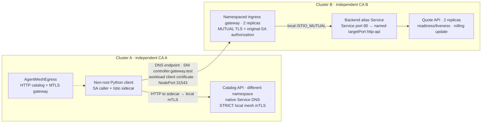

# Real application verification

This extends the three-CRD verification with a working JSON quote API and a
Python HTTP client. It tests actual Kubernetes Deployments and Istio proxies,
including independent CAs, gateway authorization and policy revocation. It is a
functional integration test, not a throughput benchmark or a penetration test.

Current declarations use `agentmesh.newtonguass.github.io/v1alpha1`. The recorded
full application runs preceded this API group rename; VERIFICATION.md separates
those results from the subsequent focused API verification.

## Reproduce from a fresh checkout

Follow [TESTING.md](TESTING.md) sections 3–5 to create the dedicated modern lab,
install Istio, and build/load this checkout's controller image into **both**
nodes. No AgentMesh CRDs should already be installed. Then run from the repository
root:

```sh
.venv/bin/python -m unittest discover -s . -p 'test_*.py' -v
mkdir -p application-evidence
set -o pipefail
.venv/bin/python -u verify_application.py 2>&1 | tee application-evidence/run.log
```

This includes the existing `verify_agent_mesh.py` whitelist checks and the full
mTLS regression contract. Do not run those scripts concurrently or install the
example CRs first. Allow several minutes for rollouts and negative trust tests.
The script creates the certificates, DNS entries, controllers and application
fixtures, and cleans them up in `finally`.

For the **already prepared** legacy labs described in TESTING.md, stop the modern
nodes first, start `cluster-a-control-plane` and `cluster-b-control-plane`, wait
for Istio readiness, and load the same rebuilt controller image into both nodes:

```sh
mkdir -p application-legacy-evidence
set -o pipefail
AGENT_MESH_LEGACY=1 .venv/bin/python -u verify_application.py 2>&1 |
  tee application-legacy-evidence/run.log
```

Default contexts are `kind-mesh-access134-a/b` in
`/tmp/mesh-access-k134.config`; the legacy switch selects `kind-cluster-a/b` in
the default kubeconfig. These are dedicated local labs, never company contexts.
The application source is mounted from a ConfigMap; it does not add a server or
test dependency to the controller image.

Require exit code zero, a `complete` record, no `failure` record, and final
`cleanup` in the evidence directory's `results.json`. Archive that directory
before another run overwrites it. The controller source hashes are checked
inside both controller pods. `APP_DISCOVERY_ONLY=1` is solely for reproducing old
bugs: it skips the full regression suite and does not require their fixes, so it
must **not** be used to claim a passing delivery test.

## Application topology



The client sends HTTP on logical port 443 to its sidecar; the sidecar originates
mTLS. The gateway terminates this connection, authorizes the original requester
SA, and starts a separate local mesh connection to the backend. The backend
continues to authorize the gateway SA. Neither cluster shares its CA private key.

The API accepts `POST /api/quote`, calculates integer prices and returns a request
ID, total, SHA-256 of the received body, serving pod and application version. The
client validates these fields, so HTTP 200 alone is insufficient. Tests exercise:

- JSON POSTs, Unicode data, a payload with 128 KiB of padding, and HTTP/1.1
  connection reuse.
- Eight concurrent clients with 25 requests each, and 120 fresh connections
  whose responses must cover both backend replicas.
- Cross-namespace native Service DNS and a **DNS** upstream endpoint for the
  remote gateway, independently of the logical URL port.
- Wrong actual requester SA, an undeclared native Service, an undeclared HTTP
  authority, a mismatched authority port, and revoked access.
- 600 requests during a backend `v1` → `v2` rolling update, followed by fresh
  requests that must all reach `v2`.
- Revocation while an invalid, unused TrustedBundle is staged, with separate
  failed status for that bundle and successful status for the active egress CR.

Application containers run as UID/GID 10001 with a read-only root filesystem,
all capabilities dropped, no privilege escalation and RuntimeDefault seccomp.
Their pods disable shared process namespaces and automatic application API-token
mounts. The test verifies the application has neither the usual API token nor an
SDS socket mount. Istio retains its own projected token for workload identity.
This does not establish resistance to every same-pod bypass.

This is **application-container** hardening, not proof that the whole pod passes
Restricted Pod Security Admission: classic Istio traffic-capture init containers
have additional privilege requirements. See the official
[Istio CNI guide](https://istio.io/latest/docs/setup/additional-setup/cni/) and
[Kubernetes Pod Security Standards](https://kubernetes.io/docs/concepts/security/pod-security-standards/)
before enforcing a whole-pod admission policy. OPA or another admission system
was not installed or tested in this run.

## Bugs reproduced and fixed

| Trigger | Unchanged controller observation | Change |
|---|---|---|
| A permitted DNS authority uses uppercase letters | Real JSON POST returned 403 | HTTP RBAC uses an exact, case-insensitive StringMatcher; destination port is still checked |
| An invalid unused CA bundle is staged while local access is revoked | All three fresh requests to the revoked API still returned 200 | Validate bundles independently; an unused invalid bundle cannot block the active plan |

The initial discovery evidence is retained locally in
`application-discovery-evidence/`. That run reproduced both bugs but did not
record `complete`; it is diagnostic evidence, not a successful full test. The
harness now replays only the desired CR spec when restoring a policy, avoiding
an old resourceVersion/status snapshot.

An invalid or missing **required selected** trust bundle still fails namespace
reconciliation and retains the last good configuration. Other invalid active
declarations can also block a namespace plan. This change isolates unused bundle
validation; it does not redesign reconciliation into independent transactions.
Monitor `Configured=False` and verify revocation in active Envoy state and fresh
traffic. Deleting an Egress CR unenrolls its SA; use an empty destination list to
retain an explicit deny-all whitelist for captured traffic.

## Hardening recommendations — enforce outside this controller

These are proposed platform controls, **not implemented or verified by this
suite**. AgentMesh remains responsible for translating its three CRDs into
scoped Istio configuration. OPA Gatekeeper validates Kubernetes admission
requests; it does not inspect or stop a running pod's network requests. An OPA
service used for request authorization is a separate integration requiring a
proxy or application to call it. See [Gatekeeper's webhook responsibilities](https://open-policy-agent.github.io/gatekeeper/website/docs/operations/).

| Priority | Risk / gap | Recommended control | Enforcing component / owner | Acceptance check |
|---|---|---|---|---|
| Highest | Old proxy/control-plane vulnerabilities undermine policy | Move company deployments to a maintained Kubernetes/Istio pairing and current security patches; retain the legacy lab only for compatibility testing | Platform/mesh release management | Verify supported versions, patched images and this traffic suite after upgrades |
| Highest | Compromised application bypasses its outbound sidecar | Default-deny pod egress; permit required DNS/control-plane dependencies and approved destinations. Where strict hostname egress is required, force traffic through a separately protected egress gateway/proxy | NetworkPolicy-capable CNI + platform-owned egress gateway | An unauthorized destination remains unreachable even when local proxy capture is unavailable; approved traffic still works |
| Highest | A developer or compromised API identity grants itself broader egress or trust | Bound allowed CR hosts, ports, protocols, SAs, gateway selectors and requester principals; restrict trust/config updates and deletion of mandatory Egress/config resources to approved owners | Kubernetes RBAC + OPA Gatekeeper / admission policy | An out-of-scope CR, trust edit or unauthorized unenrollment is rejected; valid developer declarations and controller reconciliation succeed |
| Highest | Workload author chooses another authorized SA or tampers with Istio controls | Bind workload authors to approved SAs; restrict direct Istio-resource writes and enrollment metadata; forbid injection opt-out and unapproved capture exclusions | RBAC + OPA Gatekeeper / admission policy | A workload using an unapproved SA, disabling capture or forging enrollment settings is rejected, including updates |
| High | Excessive container privileges increase same-pod/host compromise impact | Non-root application UID distinct from the proxy; drop capabilities; forbid privilege escalation, privileged/host namespaces and dangerous host mounts; seccomp and read-only application root filesystem | Pod Security Admission + OPA Gatekeeper for additional constraints; mesh team for Istio CNI | Unsafe application, init and ephemeral-container specs are rejected; normal injection and rollouts still work |
| High | Process sharing or credential mounts expose sidecar identity material | Disallow shareProcessNamespace except approved exceptions; keep SDS volumes and Istio identity tokens out of application mounts; disable unnecessary application API-token automounts | OPA Gatekeeper + workload/injector configuration | Application container lacks these mounts; pod updates/debug additions cannot introduce them. This reduces exposure, not proof of complete sidecar isolation |
| High | API credentials permit exec/debug, policy edits or identity escalation | Least privilege for pods/exec, pods/attach, pods/ephemeralcontainers, workload changes, Secrets and token creation; temporary audited operator access | Kubernetes RBAC + API audit/identity platform | Application SA cannot perform these operations; approved operator access is time-bound and logged |
| High | Alternate ingress path avoids destination authorization | Retain STRICT backend mTLS and gateway-SA authorization; limit backend network ingress to approved gateway/mesh callers; keep gateway principal rules scoped to the exposed host | Destination namespace owner: Istio policies + CNI NetworkPolicy | Wrong actual requester SA fails at gateway; unapproved direct backend paths fail; ordinary approved HTTPS continues to work |
| High | A trusted foreign issuer can mint an accepted identity | Approve issuers as security principals; restrict bundle ownership and distribute overlapping roots for rotation. Use separate trust groups/gateways where issuers must not share authority | PKI/security owner + GitOps/admission governance | Only approved public roots enter bundles; fresh connections verify rotation. A SPIFFE string alone does not bind one trusted issuer to one trust domain |
| Medium | A compromised authorized SA abuses operations it is already allowed to call | Enforce business permissions, per-user authorization, quotas and rate limits at the destination | Application/API gateway; optional OPA request-authorization integration | A valid workload certificate still cannot perform a business action outside the caller's application permissions |
| Medium | Policy drift, failed reconciliation or established sessions extend access | Alert on Configured=False, xDS rejection, policy drift and suspicious runtime activity; define an incident procedure to close existing connections when immediate revocation is needed | Monitoring/SIEM/runtime detection + namespace/network operators | Exercise a failed policy update and a long-lived session; confirm alerts and the documented containment procedure |

Istio 1.13 reached upstream end of life on October 12, 2022. The preserved
1.24.17/1.13.5 lab is a compatibility test, not an upstream-supported pairing or
a security recommendation. See [Istio's support matrix](https://istio.io/latest/docs/releases/supported-releases/).

The highest-priority networking recommendation follows Istio's documented
[sidecar capture boundary and egress guidance](https://istio.io/latest/docs/ops/best-practices/security/).
Standard [NetworkPolicy](https://kubernetes.io/docs/concepts/services-networking/network-policies/)
works at pod/network level, not between containers sharing a pod, and has no
standard DNS-hostname policy field. It therefore cannot, by itself, isolate the
application from its own sidecar or reproduce the CRD's complete HTTP/SNI rules.
Allowing a shared destination IP also does not authorize just one hostname there.
Choose and test the CNI/gateway enforcement appropriate to that requirement.

Whole-pod privilege constraints must accommodate the installed injector: use an
appropriate Istio CNI setup before requiring application pods to have no
privileged capture init container. A blanket privileged-namespace exception
would weaken the intended controls. Shared process namespace restrictions need
an additional admission rule; do not assume the Restricted profile covers them.
See [process namespace sharing](https://kubernetes.io/docs/tasks/configure-pod-container/share-process-namespace/)
and [RBAC privilege-escalation considerations](https://kubernetes.io/docs/concepts/security/rbac-good-practices/).

Admission policies must cover the actual injected Pod as well as supported
workload templates and relevant subresource updates, with narrow controller
exceptions. Test admission failure behavior and audit existing resources before
enforcement. No Gatekeeper ConstraintTemplates, CNI policies, OPA service or new
controller permissions are added by this change.

## Reading results and limits

`results.json` records client-observed request counts and returned statuses. The
Python client does not automatically retry a POST. Proxy retry behavior is not
disabled; the captured source routes include Istio-generated retry policies.
These counts therefore do not measure individual upstream connection attempts.
Positive checks may repeat whole batches
while waiting for configuration convergence; their recorded successful batch is
not an availability measurement over the convergence interval. The rolling-update
batch records all 600 outcomes without retrying that batch, including any errors.
Inspect that row separately; the suite requires convergence to `v2` but does not
impose a zero-error rollout SLO.

Both clusters have one kind node. Gateway/backend replicas test service routing
and pod replacement, **not multi-node availability**. The gateway is reached
through NodePort; no cloud load balancer, production DNS provider, multi-zone
network, CNI NetworkPolicy enforcement or OPA policy was exercised. Database
transactions, HTTP/2/gRPC, WebSocket upgrades and long-running streams are outside
this test. The TCP regression sends a simple payload through opaque TCP routing;
it is not a database-protocol test.

See [VERIFICATION.md](VERIFICATION.md) for the completed version matrix and exact
runtime hashes. Follow TESTING.md section 9 to confirm cleanup and stop the lab
nodes when finished. Stopping preserves the clusters for a later verification.
