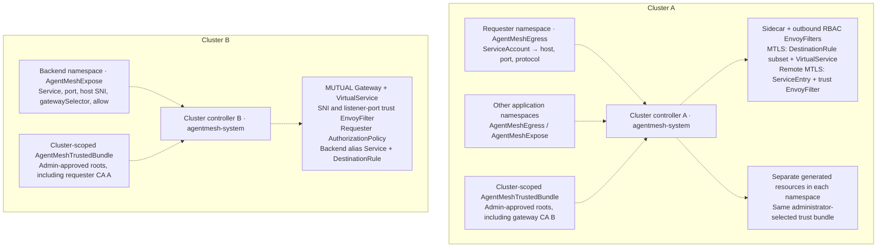
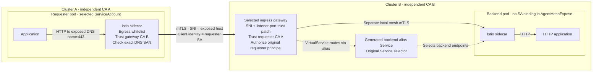

# AgentMesh: egress whitelists and cross-cluster mTLS

A cluster-wide controller for Istio sidecar meshes with independent CAs.
The API has exactly three CRDs, all using
`apiVersion: agentmesh.io/v1alpha1`:

| CRD | Scope / owner | Purpose | Main fields |
|---|---|---|---|
| AgentMeshEgress | Namespace / developer | Whitelist captured outbound traffic for a ServiceAccount | serviceAccount, inCluster/outCluster host + port + protocol |
| AgentMeshExpose | Namespace / developer | Expose an HTTP Service through a selected mTLS gateway | service, port, host, gatewaySelector, allow |
| AgentMeshTrustedBundle | Cluster / administrator | Supply shared approved public CA certificates | caBundle |

AgentMeshExpose has **no serviceAccount field**. It preserves the backend
Service selector; selected pods can use different accounts. The allow list
identifies authenticated remote requesters at the gateway.

Read [AGENT-MESH.md](AGENT-MESH.md) for the complete setup guide, all three CR
examples, protocol meanings, trust updates, gateway prerequisites and migration
from the removed API. [examples.yaml](examples.yaml) is a copyable template;
replace placeholders; apply Egress/Expose in application namespaces and the bundle once per cluster.

Run [TESTING.md](TESTING.md) for a fresh two-cluster verification lab, including
independent CAs, DNS, a namespaced ingress gateway, real mTLS, negative controls
and cleanup. [VERIFICATION.md](VERIFICATION.md) records the tested source and results.
For JSON API traffic, concurrent requests, hardened application containers and
rolling updates, see [APPLICATION-VERIFICATION.md](APPLICATION-VERIFICATION.md).
Its [hardening table](APPLICATION-VERIFICATION.md#hardening-recommendations--enforce-outside-this-controller)
assigns recommended controls to admission policy, RBAC, CNI, PKI and application owners.

The controller generates Sidecar, ServiceEntry, DestinationRule subset,
VirtualService, EnvoyFilter and gateway authorization resources. MTLS means the
application sends HTTP and its sidecar originates TLS with its workload
certificate. HTTPS means application TLS. Egress enforcement applies to traffic
captured by the sidecar; it does not prevent capture bypass.

The runtime uses Python's standard library and a controller ClusterRole.
It does not read Secrets, share CA private keys, issue certificates, or deploy
gateway workloads. The administrator selects one shared public bundle for all
managed namespaces. Developers need no bundle references, controller installations,
or enrollment labels for supported Deployment/StatefulSet/DaemonSet workloads.

## Architecture

Each cluster runs one controller in `agentmesh-system`. Developers declare egress
and exposure; the cluster administrator supplies approved public roots. Dashed arrows
below show configuration, not application traffic.

The administrator's ConfigMap in `agentmesh-system` selects one TrustedBundle by
name and supplies shared gateway defaults. Each controller manages Kubernetes/Istio configuration; Istiod delivers
it to Envoy. A namespace can contain both egress and exposure declarations.
Gateway workloads, application Services, DNS and certificate issuance already
exist; the controllers do not create them. The generated backend alias Service
preserves the exposed Service's selector, with no backend ServiceAccount binding.

`install.yaml` grants the controller bundle read/status permissions, with no
bundle-spec writes or Secret access. Bind `agentmesh-developer` through a RoleBinding
in each developer namespace. Only administrators receive trust-management rights.
Existing namespaced bundle installations require the scope migration in
[AGENT-MESH.md](AGENT-MESH.md#upgrade-from-namespaced-trust-and-controllers).

## Cross-cluster request

This is the `MTLS` protocol path. The gateway terminates the requester's TLS and
opens a separate local mesh mTLS connection to the backend.

The gateway checks the original requester identity. The backend authenticates
the gateway's identity, so any restrictive backend policy must allow the gateway
SA. Each mesh retains its own CA private keys; only public trust is exchanged.
Gateway server certificates come from its existing `credentialName` Secret via
SDS. The trust EnvoyFilter preserves that certificate configuration.

For other egress protocols, `HTTP` uses HTTP routing, `HTTPS` carries application
TLS with SNI/port checks, and `TCP` grants explicit destination IPs/ports. These
whitelist rules apply to sidecar-captured traffic. See [AGENT-MESH.md](AGENT-MESH.md)
for complete protocol and setup details.
