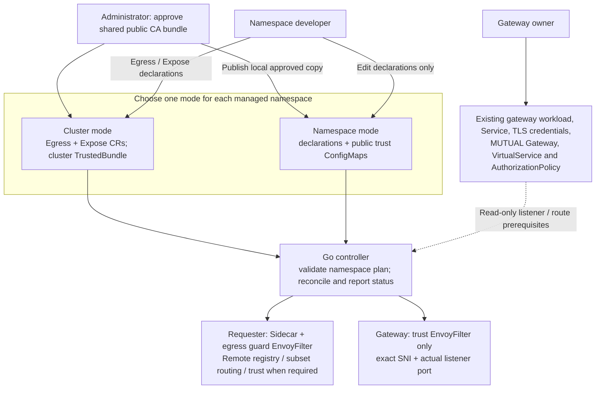

# AgentMesh: egress whitelists and cross-cluster mTLS

A Go controller for Istio sidecar meshes with independent CAs. Developers declare
captured egress permissions and gateway exposure trust. Administrators approve CA
trust; gateway owners manage listeners, routes, credentials and authorization.

| API (`agentmesh.io/v1alpha1`) | Scope / owner | Purpose |
|---|---|---|
| AgentMeshEgress | Namespace / developer | Map a ServiceAccount to allowed host, port and protocol entries |
| AgentMeshExpose | Namespace / developer | Add trust to an existing gateway's exact SNI and listener port |
| AgentMeshTrustedBundle | Cluster / administrator | One shared approved public CA bundle per cluster |

**Two installation choices:** cluster-wide CRDs using [install.yaml](install.yaml),
or namespace-only ConfigMaps using [install-namespaced.yaml](install-namespaced.yaml).
Namespace mode needs no AgentMesh CRDs or cluster RBAC. It reads a local administrator-published
copy of the approved public bundle. Both modes use the same Go reconciliation code.

**Expose is trust-only.** It has no serviceAccount or allow field and creates only
an EnvoyFilter. AgentMesh does not read or write AuthorizationPolicy, or change
existing gateway Deployments, labels, Services, RBAC, Secrets, listeners or routes.
The owner uses Istio's native authorization API independently.

Start with the complete [setup and migration guide](AGENT-MESH.md), or follow the
[namespace-only installation steps](NAMESPACE-INSTALL.md).
[TESTING.md](TESTING.md) creates a fresh two-cluster lab; [VERIFICATION.md](VERIFICATION.md)
records actual tested builds and outcomes. [APPLICATION-VERIFICATION.md](APPLICATION-VERIFICATION.md)
covers JSON payloads, concurrency, rollout tests and the
[external hardening recommendations](APPLICATION-VERIFICATION.md#hardening-recommendations--enforce-outside-this-controller).

## Architecture



```mermaid
sequenceDiagram
    participant App as Requester app · cluster A
    participant Src as Source sidecar · CA A identity
    participant GW as Existing ingress gateway · cluster B
    participant Backend as Backend sidecar and app · cluster B
    App->>Src: HTTP to declared MTLS host:port
    Note over Src: Enforce captured whitelist; select MTLS subset<br/>Trust approved server CA; verify DNS SAN
    Src->>GW: mTLS with original workload identity + exact SNI
    Note over GW: Owner MUTUAL listener + AgentMesh trust filter<br/>Owner AuthorizationPolicy checks requester
    GW->>Backend: Owner-configured local mesh mTLS as gateway SA
    Backend-->>GW: Application response
    GW-->>Src: Response
    Src-->>App: HTTP response
```

Application HTTPS remains application TLS. Protocol MTLS expects application
HTTP and originates TLS in the source sidecar. Backend authorization after
termination sees the gateway SA. See the guide for same-cluster ingress access,
HTTP-named Service aliases, native sidecars and CA rotation.

Captured sidecar egress is not a complete containment boundary for a compromised
pod. Network enforcement, admission controls such as OPA Gatekeeper, credential
protection and business authorization remain separate platform/application controls.
